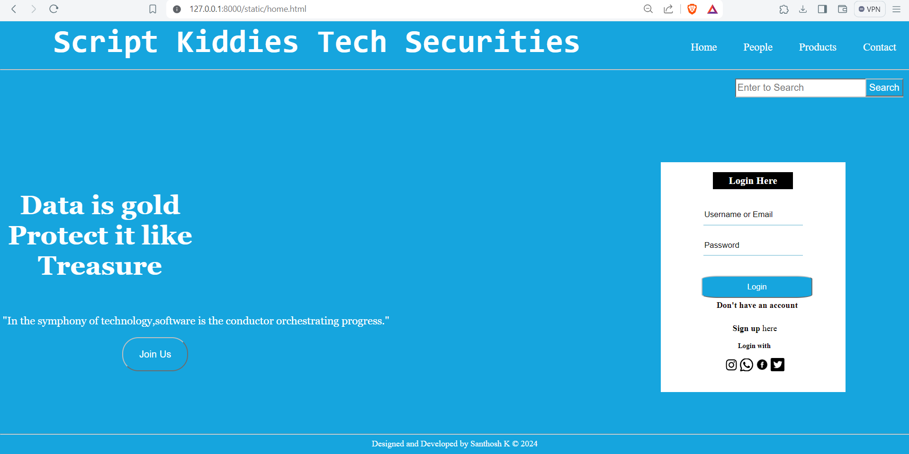
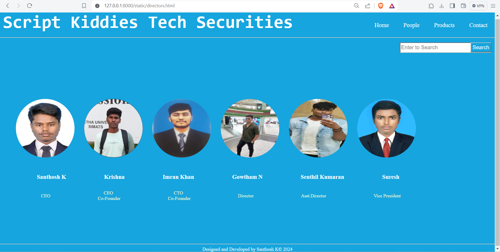
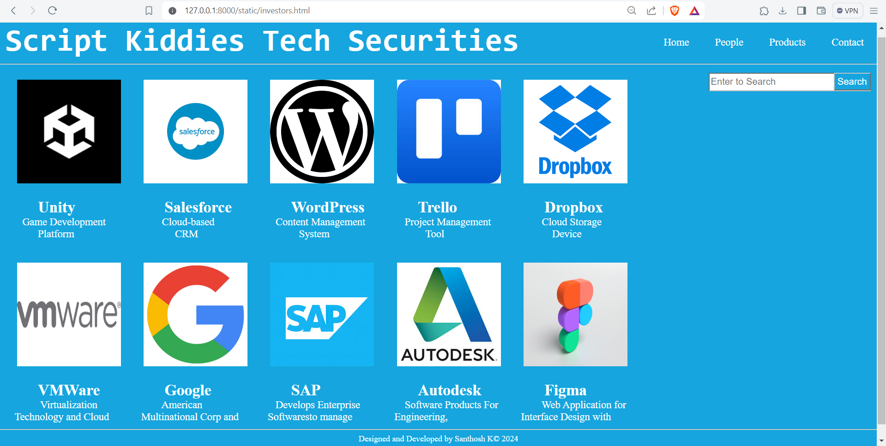
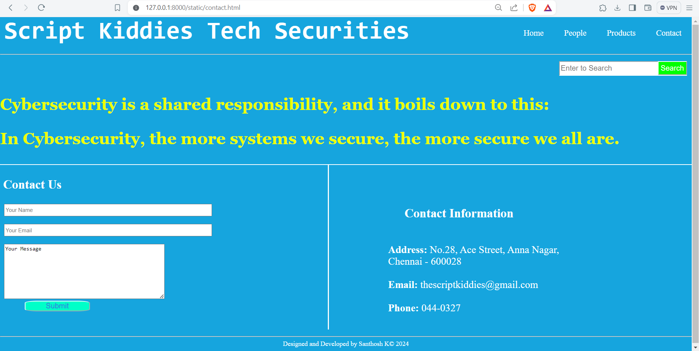

# Ex.07 Software Product Company Website
## Date:29/04/2024

## AIM:
To develop a static company website to display the softwares and services provided by the company.

## DESIGN STEPS:

### Step 1:
Requirement collection.

### Step 2:
Creating the layout using HTML and CSS.

### Step 3:
Updating the sample content.

### Step 4:
Choose the appropriate style and color scheme.

### Step 5:
Validate the layout in various browsers.

### Step 6:
Validate the HTML code.

### Step 7:
Publish the website in the given URL.

## PROGRAM:
### home.html
```
<!DOCTYPE html>
<html lang="en">

<head>
    <meta charset="UTF-8">
    <meta name="viewport" content="width=device-width, initial-scale=1.0">
    <title>Script Kiddies</title>
    <style>
        h1 {
            color: rgb(255, 255, 255);
            font-size: 45px;
            font-family: Georgia, 'Times New Roman', Times, serif;
            position: absolute;
            top: 35%;
        }

        body {
            background-color: rgb(22, 165, 222);
            margin: 0;
        }

        .navbar ul {
            list-style-type: none;
            background-color: rgb(0, 0, 0);

        }

        .navbar a {
            color: white;
            text-decoration: none;
            padding: 25px;
            display: flex;
            text-align: left;
            position: relative;
            font-size: 20px;
            top: -95px;

        }

        .navbar a:hover {
            background-color: rgb(235, 235, 235);
            size: 60px;
            cursor: pointer;
        }

        .navbar li {
            float: right;
        }

        h2 {
            color: white;
            font-family: monospace;
            font-size: 60px;
            background-color: rgb(22, 165, 222);
        }

        footer {

            background-color: rgb(22, 165, 222);
            height: 50px;
            bottom: 0;
            width: 100%;
            color: rgb(255, 255, 255);
            position: absolute;
            text-align: center;

        }

        header {
            background-color: rgb(22, 165, 222);
            height: 10vh;
            width: 100%;
            color: white;
        }

        header h2 {
            position: absolute;
            color: white;
            margin-top: 3px;
            margin-left: 100px;
        }

        .first,
        .second,
        .third {
            font-size: 50px;
            margin-left: 15px;
        }

        .second {
            color: rgb(255, 255, 255);
            text-align: center;
        }

        .third {
            text-align: center;
        }
        .first{
            text-align: center;
        }
        .search input,
        button {
            position: absolute;
            right: 12px;
            font-size: 18px;
            border-color: silver;
        }

        .d {
            position: absolute;
            top: 65%;
            font-size: 20px;
        }

        .search input {
            width: 18%;
            height: 30px;

        }
        .d p{
            color: white;
        }

        .search button,
        .d button {
            color: white;
            background-color: rgb(22, 165, 222);
            padding: 5px;
            text-align: center;
        }

        .d button {

            margin-right: 50%;
            padding: 20px 30px 20px 30px;
            border-radius: 30px;
            border-color: none;
        }

        #joinus:hover {
            cursor: pointer;
            color: rgb(5, 20, 15);
            background-color: rgb(215, 249, 250);
        }

        .login form {
            position: absolute;
            right: 100px;
            top: 30%;
            margin: 20px;
            box-sizing: border-box;
            border-color: rgb(105, 62, 7);
            background-color: rgb(255, 255, 255);
            padding: 80px 80px 200px 80px;
        }

        .login form button {
            background-color: rgb(22, 165, 222);
            margin-right: 50px;
            color: white;
            padding: 10px 35px 10px 35px;
            font-size: 15px;
            border-radius: 15%;
            width: 60%;
        }

        .login form h3 {
            color: rgb(255, 255, 255);
            position: absolute;
            top: 0%;
            padding: 5px 30px 5px 30px;
            background-color: rgb(0, 0, 0);
            text-align: center;
            margin-left: 18px;


        }

        .login form input {
            height: 35px;
            border: none;
            border-bottom: 2px solid lightblue;
            font-family: Arial, Helvetica, sans-serif;
            color: rgb(134, 28, 28);
            font-size: 15px;
            background: transparent;
        }

        .login ::placeholder {
            color: rgb(0, 0, 0);
            opacity: 1;
        }

        .login form h4 {
            position: absolute;
            top: 55%;
            color: rgb(19, 3, 3);
            margin-left: 25px;
        }

        .login form .Signup {
            position: absolute;
            top: 70%;
            color: rgb(0, 0, 0);
            margin-left: 35px;
        }

        .login form .Signup b a {
            text-decoration: none;
            color: rgb(0, 0, 0);
            margin-left: 20px;
        }

        .login form h5 {
            position: absolute;
            top: 73%;
            color: rgb(0, 0, 0);
            margin-left: 65px;
        }

        .login form .image {
            position: absolute;
            top: 85%;
            margin-left: 40px;

        }

        .d p {
            font-family: Georgia, 'Times New Roman', Times, serif;
        }
    </style>
</head>

<body>
    <header>
        <h2>Script Kiddies Tech Securities</h2>
    </header>
    <hr>
    <nav class="navbar">

        <ul>
            <li><a href="info.html">Contact</a></li>
            <li><a href="investors.html">Products</a></li>
            <li><a href="directors.html">People</a></li>
            <li><a href="home.html">Home</a></li>
        </ul>
    </nav>

    <div class="search"><input type="text" placeholder="Enter to Search">
        <button>Search</button>
    </div>
    <h1>
        <div class="first"> Data is gold</div>
        <div class="second"> Protect it like<br> </div>
        <div class="third"> Treasure</div>
    </h1>
    <div class="d">
        <p> &nbsp;"In the symphony of technology,software is the conductor orchestrating progress."                            </p>
        <button id="joinus">Join Us</button>
    </div>
    <div class="login">
        <form>
            <h3>Login Here</h3>
            <input type="text" placeholder="Username or Email"><br><br>
            <input type="password" placeholder="Password"><br><br><br>
            <button>Login</button>
            <h4>Don't have an account</h4><br>
            <div class="Signup"><b><a href="">Sign up</a></b> here</div>
            <h5>Login with</h5>
            <div class="image">
                
                
                
                
            </div>
        </form>
    </div>
    
    <footer>
        <hr>
        Designed and Developed by Santhosh K &copy; 2024
    </footer>

</body>

</html>
```
### directors.html
```
<!DOCTYPE html>
<html lang="en">
<head>
    <meta charset="UTF-8">
    <meta name="viewport" content="width=device-width, initial-scale=1.0">
    <title>directors</title>
    <style>
        h1{
        color: blue;
        font-size: 45px;
        font-family:Georgia, 'Times New Roman', Times, serif;
        position: absolute;
        top:35%;
        }
        body{
        background-color:rgb(22, 165, 222);
        margin:0;
        }
        .navbar ul{
        list-style-type:none;
        background-color:rgb(22, 165, 222);
        
        }
        .navbar a{
         color:white;
        text-decoration:none;
        padding:25px;
        display:flex;
        text-align:left;
        position: relative;
        font-size:20px;
        top:-95px;
        
        }
        .navbar a:hover{
         background-color:lightblue;
        size:60px;
        cursor: pointer;
        }
        .navbar li{
        float:right;
        }
        h2{
        color:white;
        font-family:monospace;
        font-size:60px;
        background-color:rgb(22, 165, 222);
        }
        footer{

        background-color:rgb(22, 165, 222);
        height:30px;
        bottom:0;
        width:100%;
        color:white;
        position:absolute;
        text-align: center;
        }
        header
        {
        background-color:rgb(22, 165, 222);
        height:10vh;
        width:100%;
        color:white;
        }
        header h2{
        position:absolute;
        color:white;
        margin-top:3px;
        margin-left:10px;
        }
        .search input{
            width:18%;
            height: 30px;

        }
        .search button{
            color:white;
            background-color: rgb(22, 165, 222);
            padding: 5px;
            text-align: center;
        }
        .search input,button{
            position: absolute;
            right: 12px;
            font-size: 18px;
            border-color:silver;
        }
        .small
        {
           width:200px;
           height:200px;
           margin:10px;
        }
        .border{
        border-width:5px;
        border-color:rgb(22, 165, 222);
        border-style:solid;
        border-radius:50%;
        }
        .cirpic{
            position:absolute;
            top:35%;
            margin-left: 40px;
        }
        .text{
            position:absolute;
            top: 60%;
            margin-left: 60px;
            font-size: 20px;
            color: white;
        }
        .text2{
            position:absolute;
            top:65%;
            margin-left:58px;
            color: lightgoldenrodyellow;
        }
    
    </style>
</head>
<body>
    <header>
        <h2>Script Kiddies Tech Securities</h2>
        </header>
        <nav class="navbar">
        <hr>
        <ul>
        <li><a href="contact.html">Contact</a></li>
        <li><a href="investors.html">Products</a></li>
        <li><a href="directors.html">People</a></li>
        <li><a href="home.html">Home</a></li>
        </ul>
        </nav>
        <div class="search"><input type="text" placeholder="Enter to Search">
            <button>Search</button></div>
        <div class="cirpic">
            
            
            
            
            
            
        </div>
        <div class ="text">
            <table cellpadding="64">
                <tr div class="head">
                    <th>Santhosh K</th>
                    <th>Krishna</th>
                    <th>Imran Khan</th>
                    <th>Gowtham N</th>
                    <th>Senthil Kumaran</th>
                    <th>Suresh </th>
                </tr>
            </table>
        </div>
        <div class="text2">
            <table cellpadding="80">
                <tr>
                    <td>CEO</td>
                    <td>&nbsp;&nbsp;&nbsp;&nbsp;&nbsp;CEO<br>Co-Founder</td>
                    <td>&nbsp;&nbsp;&nbsp;&nbsp;&nbsp;CTO<br>Co-Founder</td>
                    <td>Director</td>
                    <td>Asst.Director</td>
                    <td>Vice President</td>
                </tr>
            </table>
        </div>
      
            <footer>
                <hr>
                Designed and Developed by Santhosh K&copy; 2024
                </footer>
        
               
</body>
</html>

```
### investors.html
```
<!DOCTYPE html>
<html lang="en">
<head>
    <meta charset="UTF-8">
    <meta name="viewport" content="width=device-width, initial-scale=1.0">
    <title>Investors</title>
    <style>
        h1{
        color: rgb(22, 165, 222);
        font-size: 45px;
        font-family:Georgia, 'Times New Roman', Times, serif;
        position: absolute;
        top:35%;
        }
        body{
        background-color:rgb(22, 165, 222);
        margin:0;
        }
        .navbar ul{
        list-style-type:none;
        background-color:darkblue;
        
        }
        .navbar a{
         color:white;
        text-decoration:none;
        padding:25px;
        display:flex;
        text-align:left;
        position: relative;
        font-size:20px;
        top:-95px;
        
        }
        .navbar a:hover{
         background-color:lightblue;
        size:60px;
        cursor: pointer;
        }
        .navbar li{
        float:right;
        }
        h2{
        color:white;
        font-family:monospace;
        font-size:60px;
        background-color:rgb(22, 165, 222);
        }
        footer{
        background-color:rgb(22, 165, 222);
        height:30px;
        text-align: center;
        bottom:0;
        width:100%;
        color:white;
        position:absolute;
        
        }
        header
        {
        background-color:rgb(22, 165, 222);
        height:10vh;
        width:100%;
        color:white;
        }
        header h2{
        position:absolute;
        color:white;
        margin-top:10px;
        margin-left:10px;
        }
        .search input{
            width:18%;
            height: 30px;

        }
        .search button{
            color:white;
            background-color: rgb(22, 165, 222);
            padding: 5px;
            text-align: center;
        }
        .search input,button{
            position: absolute;
            right: 12px;
            font-size: 18px;
            border-color:silver;
        }
        .contain{
                position: absolute;
                top:12%;
                width:1210px;
                height:700px;
                margin-left: 10px;
                background-color:rgb(22, 165, 222);
                }
                .contain p b{
                    font-size: 30px;
                    padding-left: 45px;
                }
                .contain p{
                    font-size: 20px;
                    color: white;
                    padding-left: 15px;
                    padding:5px 20px 0px 15px ;
                }
                .contain img{
                   margin-top: 0%;
                   padding-left: 10px;
                   padding:20px 20px 0px 20px;
                }
    </style>
</head>
<body>
    <header>
        <h2>Script Kiddies Tech Securities
        </Code></h2>
        </header>
        <hr>
        <nav class="navbar">
        
        <ul>
        <li><a href="contact.html">Contact</a></li>
        <li><a href="investors.html">Products</a></li>
        <li><a href="directors.html">People</a></li>
        <li><a href="home.html">Home</a></li>
        </ul>
        </nav>
        <div class="search"><input type="text" placeholder="Enter to Search">
            <button>Search</button></div>
            <div class="contain">
                <table >
                    <tr>
                        <td>
                            <p><b>Unity</b><br>
                                &nbsp;&nbsp;&nbsp;Game Development<br>
                                &nbsp;&nbsp;&nbsp;&nbsp;&nbsp;&nbsp;&nbsp;&nbsp; Platform
                        </p></td>
                        <td><br>
                            <p><b>Salesforce</b><br>
                                &nbsp;&nbsp;&nbsp;&nbsp;&nbsp;&nbsp;&nbsp;&nbsp;Cloud-based<br>
                                &nbsp;&nbsp;&nbsp;&nbsp;&nbsp;&nbsp;&nbsp;&nbsp; &nbsp;&nbsp;&nbsp;&nbsp;CRM
                        </p></td>
                        <td><br>
                            <p><b>WordPress</b><br>
                                &nbsp;&nbsp;&nbsp;Content Management <br>
                                &nbsp;&nbsp;&nbsp;&nbsp;&nbsp;&nbsp;&nbsp;&nbsp;&nbsp;&nbsp;&nbsp;  System
                        </p></td>
                        <td><br>
                            <p><b>Trello</b><br>
                                &nbsp;&nbsp;&nbsp;&nbsp;Project Management<br>
                                &nbsp;&nbsp;&nbsp;&nbsp;&nbsp;&nbsp;&nbsp;&nbsp;&nbsp;&nbsp;&nbsp;  Tool
                        </p></td>
                        <td><br>
                            <p><b>Dropbox</b><br>
                                &nbsp;&nbsp;&nbsp;&nbsp;&nbsp;&nbsp;&nbsp;&nbsp;Cloud Storage<br>
                                &nbsp;&nbsp;&nbsp;&nbsp;&nbsp;&nbsp;&nbsp;&nbsp;&nbsp;&nbsp;&nbsp;  Device
                        </p></td>  
                    </tr>
                    <tr>
                        <td>
                            <p><b>VMWare</b><br>
                                &nbsp;&nbsp;&nbsp;   &nbsp;&nbsp;&nbsp;&nbsp;&nbsp;&nbsp;Virtualization Technology and Cloud Computing<br>
                                &nbsp;&nbsp;&nbsp; &nbsp;&nbsp;&nbsp;&nbsp;&nbsp;&nbsp;&nbsp;&nbsp;
                        </p></td>
                        <td><br>
                            <p><b>Google</b><br>
                                &nbsp;&nbsp;&nbsp;&nbsp;&nbsp;&nbsp;&nbsp;&nbsp;American Multinational Corp and Technology<br>
                                &nbsp;&nbsp;&nbsp;&nbsp;&nbsp;&nbsp;&nbsp;&nbsp; &nbsp;&nbsp;&nbsp;&nbsp;
                        </p></td>
                        <td><br>
                            <p><b>SAP</b><br>
                                &nbsp;&nbsp;&nbsp;Develops Enterprise Softwaresto manage business operations<br>
                                &nbsp;&nbsp;&nbsp;&nbsp;&nbsp;&nbsp;&nbsp;&nbsp;&nbsp;&nbsp;&nbsp;
                        </p></td>
                        <td><br>
                            <p><b>Autodesk</b><br>
                                &nbsp;&nbsp;&nbsp;&nbsp;Software Products For Engineering, Architecture, Media etc..<br>
                                &nbsp;&nbsp;&nbsp;&nbsp;&nbsp;&nbsp;&nbsp;&nbsp;&nbsp;&nbsp;&nbsp;
                        </p></td>
                        <td><br>
                            <p><b>Figma</b><br>
                                &nbsp;&nbsp;&nbsp;&nbsp;&nbsp;&nbsp;&nbsp;&nbsp;Web Application for Interface Design with additional online features<br>
                                &nbsp;&nbsp;&nbsp;&nbsp;&nbsp;&nbsp;&nbsp;&nbsp;&nbsp;&nbsp;&nbsp;


                        </p></td>  

                    </tr>
                </table>
            </div>
            <footer>
                <hr>
                Designed and Developed by Santhosh K</B>&copy; 2024
                </footer>
               
</body>
</html>
```
### contact.html
```
<!DOCTYPE html>
<html lang="en">
<head>
    <meta charset="UTF-8">
    <meta name="viewport" content="width=device-width, initial-scale=1.0">
    <title>Contact</title>
    <style>
        h1{
        color: rgb(238, 255, 0);
        font-size: 40px;
        font-family:Georgia, 'Times New Roman', Times, serif;
        position: absolute;
        top:20%;
        }
        h4{
            color: rgb(238, 255, 0);
            font-size: 40px;
            font-family: Georgia, 'Times New Roman', Times, serif;
            position: absolute;
            top: 27%;
        }
        body{
        background-color:rgb(22, 165, 222);
        margin:0;
        }
        .navbar ul{
        list-style-type:none;
        background-color:rgb(20, 20, 227);
        
        }
        .navbar a{
         color:white;
        text-decoration:none;
        padding:25px;
        display:flex;
        text-align:left;
        position: relative;
        font-size:20px;
        top:-105px;
        
        }
        .navbar a:hover{
         background-color:lightblue;
        size:60px;
        cursor: pointer;
        }
        .navbar li{
        float:right;
        }
        h2{
        color:white;
        font-family:monospace;
        font-size:60px;
        background-color:rgb(22, 165, 222);
        }
        footer{

        background-color:rgb(22, 165, 222);
        height: -10px;
        bottom: 10px;;
        width:100%;
        color:white;
        position:absolute;
        text-align: center;
        
        }
        header
        {
        background-color:rgb(22, 165, 222);
        height:10vh;
        width:100%;
        color:white;
        }
        header h2{
        position:absolute;
        color:white;
        margin-top: -3px;
        margin-left:10px;
        }
        .search input{
            width:18%;
            height: 30px;

        }
        .search button{
            color:white;
            background-color:lime;
            padding: 5px;
            text-align: center;
        }
        .search input,button{
            position: absolute;
            right: 12px;
            font-size: 18px;
            border-color:rgb(255, 255, 255);
        }
        .line{
            position: absolute;
            top:43%;
        color:  darkblue;
            width:100%;
            size:5px;
        }
        .coform {
            background-color: rgb(22, 165, 222);
            top:43%;
        }
        .coform form{
            position: absolute;
            top:45%;
        }
        .coform form h3{
            font-size:30px;
        }
        .coform form input{
            margin-left: 10px;
            width:500px;
            height:25px;
        }
        .coform form textarea{
            margin-left: 10px;
        }
        .coform form button{
            position: absolute;
            background-color:  rgb(0, 255, 200);
            color: royalblue;
            border-radius: 20%;
            margin-left: 60px;
        }
        #submit{
            left:0px;
            width:20%;
        }
        .vl{
            position:absolute;
            border-left: 3px solid rgb(255, 255, 255);
            height: 403px;
            margin-left: 800px;
            top:44%;
        }
        #ci{
            font-size: 30px;
            margin-left: 40px;
        }
        .info{
            position:absolute;
            top:44.3%;
            font-size: 25px;
            background-color: rgb(22, 165, 222);
            color: white;
            padding:70px 250px 95px 147px ;
            margin-left: 800px;
        }
        .coform form{
            background-color: rgb(22, 165, 222);
            color: white;
            top:44.3%;
            margin-left: 0px;
            padding:0px 282px 50px 0px;
        }
    </style>
    </head>
    <body>
        <header>
            
            <h2>Script Kiddies Tech Securities</h2>
            </header>
            <hr>
            <nav class="navbar">
            
            <ul>
            <li><a href="contact.html">Contact</a></li>
            <li><a href="investors.html">Products</a></li>
            <li><a href="directors.html">People</a></li>
            <li><a href="home.html">Home</a></li>
            </ul>
            </nav>
        
            <div class="search"><input type="text" placeholder="Enter to Search">
                <button>Search</button></div>
            <h1>Cybersecurity is a shared responsibility, and it boils down to this:</h1>
            <h4>In Cybersecurity, the more  systems we secure, the more secure we all are.</h4>
                <div class="line">
                    <hr color="white">
                    
            </div>
            <div class="coform">
            <form>
              <h3>&nbsp;Contact Us</h3>
              <input type="text" placeholder="Your Name"><br><br>
              <input type="text" placeholder="Your Email"><br><br>
              <textarea rows="8" cols="50" >Your Message
              </textarea><br>
              <button id="submit">Submit</button>
            </form>
        </div>
        <div class="info">
            <h3 id="ci" >Contact Information</h3><br>
            <b>Address: </b>No.28, Ace Street, Anna Nagar, Chennai - 600028<br><br>
            <b>Email: </b>thescriptkiddies@gmail.com<br><br>
            <b>Phone: </b>044-0327
        </div>
        <div class="vl"></div>
    </div>
                <footer>
                    <hr>
                    Designed and Developed by Santhosh K</B>&copy; 2024
                    </footer>
                   
    </body>
    </html>
```

## OUTPUT:





## RESULT:
The program for designing software company website using HTML and CSS is completed successfully.
